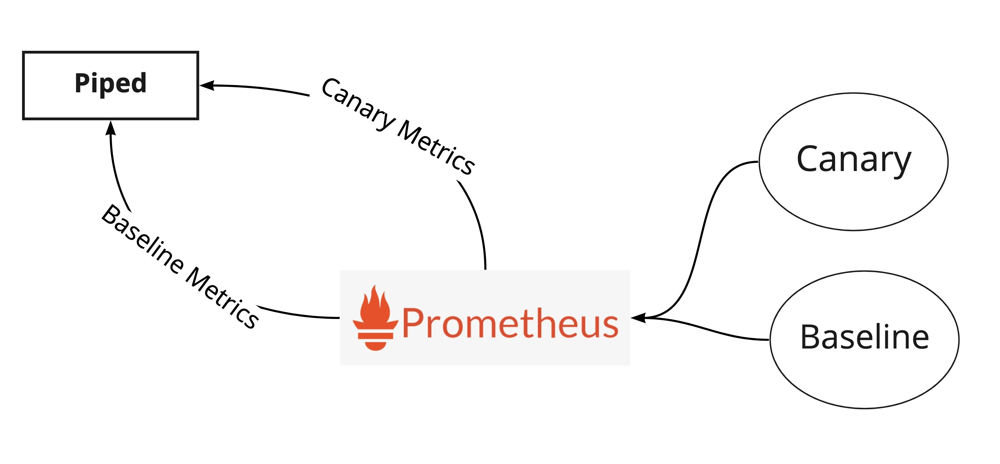

- Start Date: 2021-08-23
- Target Version: 0.16.0

# Summary
This RFC proposes supporting a new approach of Automated Deployment Analysis using dynamic data.

# Motivation
The current version of ADA supports only the solution based on static rules.
However, it is a bit tough to use when those thresholds change dynamically depending on the time of year or time of day.
Therefore, it's nice to analyze by comparing it with the metrics of currently running or from previous deployments, without specifying threshold.

# Detailed design
This proposal only focuses on analysis by metrics. We can think analysises by others like logs, https separately because we use different configuration fields for them.
This section covers what to compare and how to compare them.

### What to compare
There are two types of strategies:
- Canary Analysis
- Previous Analysis

**Canary Analysis**

In Canary Analysis, it compares Canary and Baseline (or Primary if Baseline isn't be launched).
The user needs to prepare a query for Canary and a query for Baseline.
For how to generate the queries, we discuss later.



NOTE: Although we can compare Canary with Primary, we recommend comparing with Baseline. We have to mention that on our documentation.

**Previous Analysis**

In Previous Analysis, it compares the metrics of the previous Primary deployment with the metrics of the current Primary.
This is quite useful if you can't prepare the Canary variant for some reasons.
To do that, it needs to save the previous metrics in Filestore.


### How to compare
PipeCD uses [Mann–Whitney U test](https://en.wikipedia.org/wiki/Mann%E2%80%93Whitney_U_test), a nonparametric statistical test to check for a significant difference between the metrics.
For each interval, it computes the score and ends with failure immediately if the result was out of the marginal range.

**How to implement Mann–Whitney U test**

We can implement it in Go based on [the Kayent implementation](https://github.com/spinnaker/kayenta/blob/master/kayenta-judge/src/main/scala/com/netflix/kayenta/judge/classifiers/metric/MannWhitneyClassifier.scala#L33-L55) because that algorithm is relatevely simple.
[Kayenta](https://github.com/spinnaker/kayenta) is an independent component of Spinnaker. But it requires JVM and Redis to run.
If we embed Kayenta into Piped image, the image size can be quite huge. And it's tedious that Piped depends on Redis.

### Configuration
For instance, we can configure the dynamic ANALYSIS stage like:

```yaml
apiVersion: pipecd.dev/v1beta1
kind: KubernetesApp
spec:
  pipeline:
    stages:
      - name: K8S_CANARY_ROLLOUT
        with:
          replicas: 20%
      - name: K8S_BASELINE_ROLLOUT
        with:
          replicas: 20%
      - name: ANALYSIS
        with:
          duration: 30m
          dynamic:
            metrics:
              - template: http_error_rate
                baselineArgs:
                  job: foo
                canaryArgs:
                  job: foo-canary
      - name: K8S_PRIMARY_ROLLOUT
      - name: K8S_CANARY_CLEAN
      - name: K8S_BASELINE_CLEAN
```

To generate queries for each variant, Canary and Baseline, it uses [Analysis Template](https://pipecd.dev/docs/user-guide/automated-deployment-analysis/#optional-analysis-template).
So we need to prepare the Analysis Template configuration like:

```yaml
apiVersion: pipecd.dev/v1beta1
kind: AnalysisTemplate
spec:
  metrics:
    http_error_rate:
      interval: 10m
      provider: prometheus-dev
      expected:
        max: 0.1
      query: |
        sum without(status) (rate(http_requests_total{status=~"5.*", job="{{ .Args.job }}"}[10m]))
        /
        sum without(status) (rate(http_requests_total{job="{{ .Args.job }}"}[10m]))
```

- If both Canary and Baseline are launched, it tries to compare Baseline with Canary **(Canary Analysis)**.
- If only Canary is launched, it tries to compare Primary and Canary **(Canary Analysis)**.
- If neither Canary nor Baseline are launched, it tries to compare Primary and previous Primary **(Previous Analysis)**.

Therefore, with the above configuration, it performs Canary Analysis. If you want to perform the previous analysis, just have:

```yaml
apiVersion: pipecd.dev/v1beta1
kind: KubernetesApp
spec:
  pipeline:
    stages:
      - name: ANALYSIS
        with:
          duration: 30m
          dynamic:
            metrics:
              - template: http_error_rate
                primaryArgs:
                  job: foo
      - name: K8S_PRIMARY_ROLLOUT
```


**AnalysisMetricsDynamic**

| Field | Type | Description | Required |
|-|-|-|-|
| template | string | The name of Analysis Template | Yes |
| baselineArgs | map[string][string] | The arguments to be populated for the Baseline query | No |
| canaryArgs | map[string][string] | The arguments to be populated for the Canary query | No |
| primaryArgs | map[string][string] | The arguments to be populated for the Primary query | No |

# Unresolved questions
There are a couple of unresolved questions.

### About how to store previous deployment metrics
Is Filestore really the best place to store? No considerations on storing Users metrics in Control-plane?

### About query templating
Alternatively, if we provide just `{{ .Variant }}` variable like Harness CV, the ANALYSIS configuration may be more simple.
Users have to prepare just one query for each metric like:

```yaml
apiVersion: pipecd.dev/v1beta1
kind: KubernetesApp
spec:
  pipeline:
    stages:
      - name: ANALYSIS
        with:
          duration: 30m
          dynamic:
            metrics:
              - provider: prometheus-dev
                interval: 5m
                expected:
                  max: 0.1
                query: |
                  sum without(status) (rate(http_requests_total{status=~"5.*", job="foo", variant="{{ .Variant }}"}[10m]))
                  /
                  sum without(status) (rate(http_requests_total{job="foo", variant="{{ .Variant }}"}[10m]))
      - name: K8S_PRIMARY_ROLLOUT
```

However, we could lose a kind of flexibility. Users have to configure their monitoring system to have variant labels.
For example, for Prometheus, some kind of relabel_configs is needed like:

```yaml
      - job_name: kube-state-metrics
        kubernetes_sd_configs:
          - role: endpoints
        relabel_configs:
          - source_labels: [__meta_kubernetes_service_annotation_pipecd_dev_variant]
            action: keep
            regex: variant
```

### About static ADA
Does it need to still have the static ADA feature?
If Previous Analysis goes well, it could be fine to make it deprecated because the Previous Analysis is a high level feature that wraps the static ADA.

